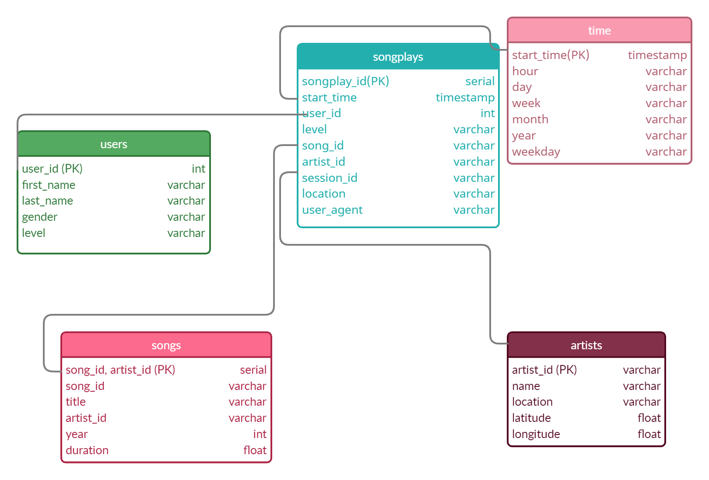

# PostGresDataModeling

## PostGres Data Modeling with Normalization and Database Creation

### Introduction

A startup called Sparkify wants to analyze the data they've been collecting on songs and user activity on their new music streaming app. The analytics team is particularly interested in understanding what songs users are listening to. Currently, they don't have an easy way to query their data, which resides in a directory of JSON logs on user activity on the app, as well as a directory with JSON metadata on the songs in their app.  

### Database Schema Design and ETL Process

Below is the schema design:

Here are the tables and steps for the ETL process:

#### Process song_data

    Use get_files to get the list of all JSON files in song/data
    
    1. songs table
    ##### Extract Data for Songs Table
        - Select song ID, title, artist ID, year, and duration
        - Use df.values to select just the values from the dataframe
        - Convert array to list and set it to song_data
    
    ##### Insert Record into Song Table
    

    2. artists table
    ##### Extract Data for Artists Table
    - Select artist ID, name, location, latitude, and longitude
    - Use df.values to select just the values for the dataframe
    - Convert the array to a list and set it to artist_data
    
    ##### Insert Record into Artist Table

#### Process log_data

    Use get_files to get the list of all JSON files in song/data

    3. time table
    ##### Extract Data for Songs Table
        - Filter records by NextSong action
        - Convert ts timestamp column to datetime
        - Extract timestamp, hour, day, week of year, month, year, and weekday from ts column and create time_data as list containing these values
        - Specify labels for columns and set to column_labels
        - Create a dataframe combining columns_labels and time_data with column_labels as header for columns
    
    ##### Insert Record into Song Table

    4. users table
    ##### Extract Data for Artists Table
    - Select user ID, first name, last name, gender, and level and set to user_df

    ##### Insert Record into Artist Table

    5. songplays Table
    #### Extract Data and Songplays Table
    - song_select query in sql_queries.py is used to find the song ID and artist ID based on title, artist name, and duration of a song
    - modify song_select query to select timestamp, user ID, level, song ID, artist ID, session ID, location, and user agent and set to songplay_data

    ##### Insert Record into Artist Table
    - Use df.iterrows() to get the song id and artist id from the song and artist tables
    - Use if else statement to pull in results
    - Insert the songplay record by adding the results as a row

### Files in repo

    | File/Folder      | Description                                                                                      |
    |------------------|--------------------------------------------------------------------------------------------------|
    | Data             | top level folder for both song_files and log_files                                               |
    | create_tables.py | python source file to connect to sparkify db, and link to file to create and drop tables         |
    | etl.ipynb        | python notebook to run tests on each table as the etl process is being developed                 |
    | etl.py           | python source file for all etl code once testing has completed                                   |
    | sql_queries.py   | contains all sql queries for creating and dropping tables, and inserting records                 |
    | test.ipynb       | python notebook for testing etl.ipynb                                                            |

### Running the python scripts

To run the python scripts, start with create_tables.py which creates the connection to the Sparkify database and connects to the sql_queries.py file that runs creates and drops tables, as well as inserting records. Next, run the etl.py file to finish the etl process.
If testing, run create_tables.py, make modifications to the etl.ipynb, and test in test.ipynb after making changes.
